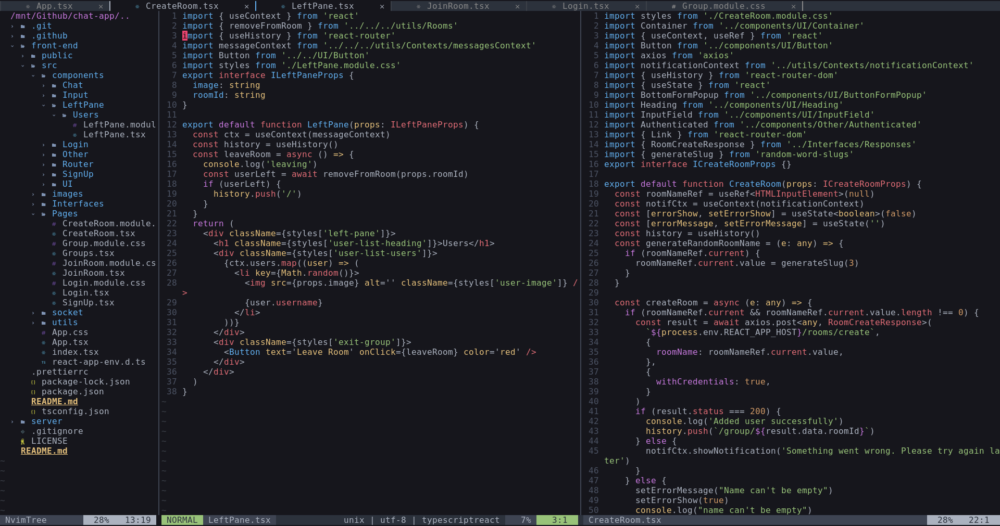
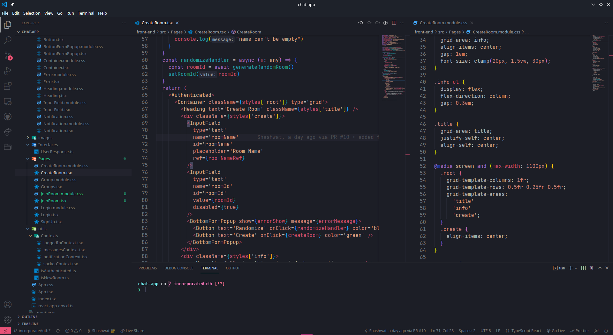
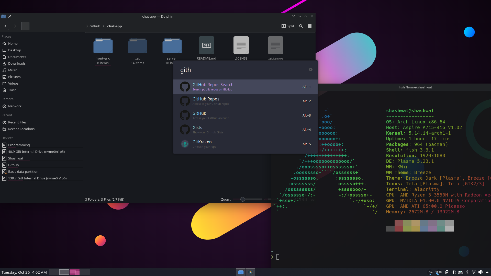

# LinuxSetup
A repository containing all of my dot files

# How it looks

# What it has

Configuration of almost everything I use. Ranging from stuff like Vim, neovim and kitty, to ncspot and tldr. There's also an arch install script which helps me set up my environment on a new machine. 

# Why

Because why not
